

## UI Examples
### Newly Updated Features And UI

### Authentication
- **Login**: Only authenticated users can access the post creation and editing pages. Users must be logged in to perform these actions.

### Event Handling
- **Post Added Event**: When a post is created, an event triggers to update the user's post count. This ensures the post count is kept accurate for each user.

### Protected Routes
- **Route Protection**: Only authenticated users can access routes that modify or view posts. Non-authenticated users will be redirected to the login page when attempting to access protected routes.

### Rules for Creating and Updating Posts
- **Validation Rules**: The creation and updating of posts are validated based on certain rules like ensuring the post has a title, body, and user association. For updates, the current user can only update their own posts.

### Register Api request
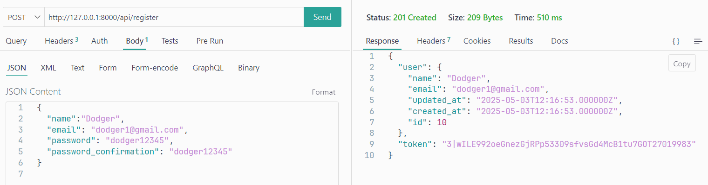

### Login Api request
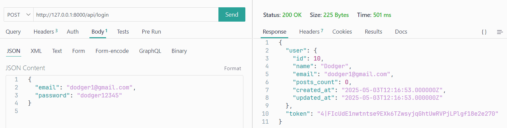

### UnAuthenticated 403 message ( requesting posts without login in )
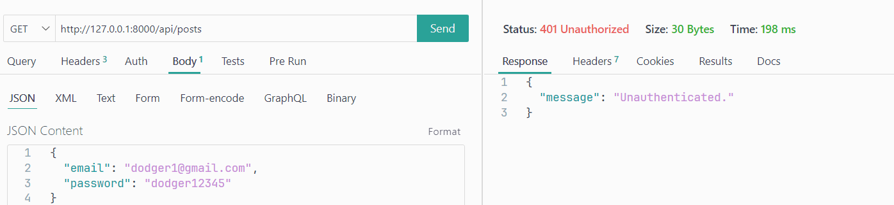

### View All Posts
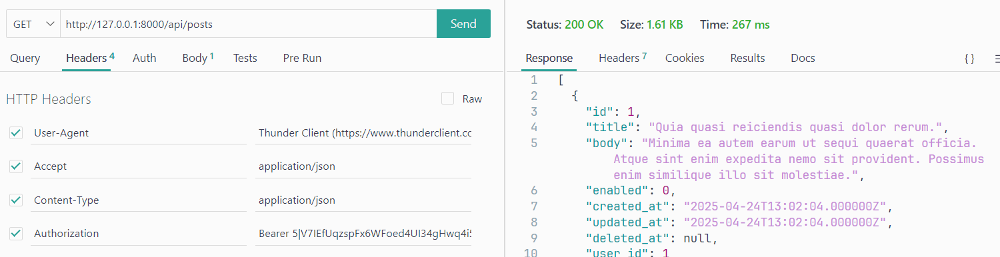

### View Single Post With ID
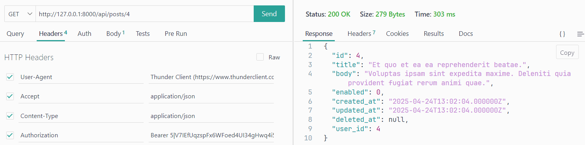

### Create new Post

### Update Post

### Delete Post

### Posts Shows New Posts For Authenticated User and Can Only Edit His Posts
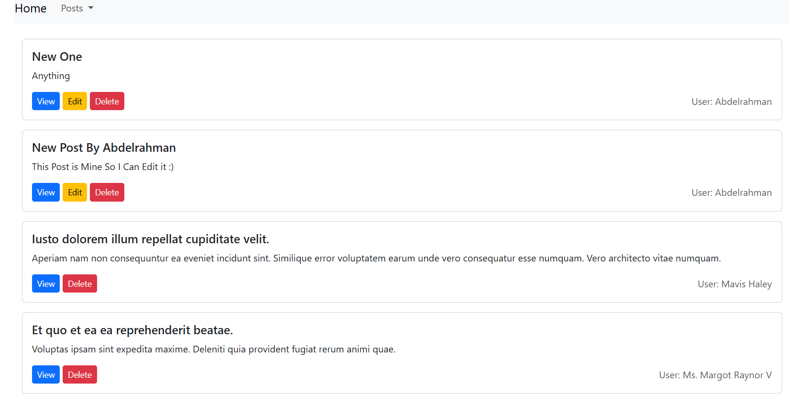

### Dashboard Shows The Current User and His Posts Count (Configured with Event)
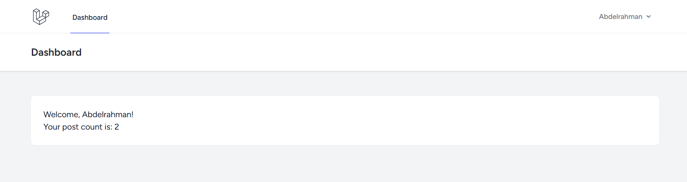

### Update Post Page Shows Unauthorized Rule When User Tries to Update a Post He Doesn't Own
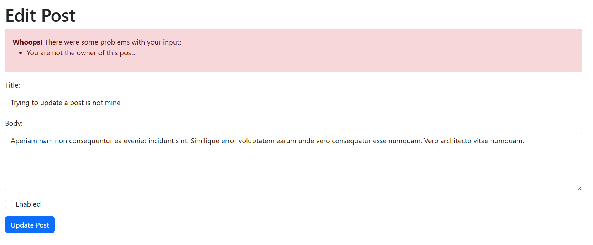

### Posts
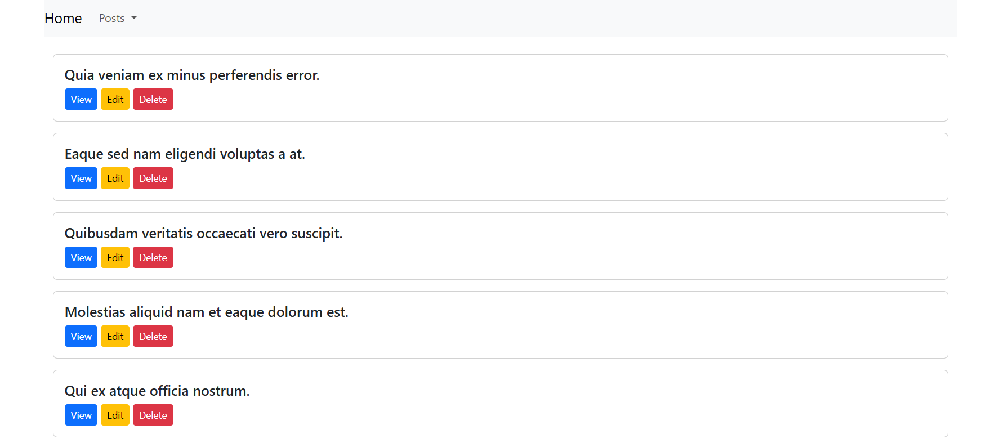

### Post Details
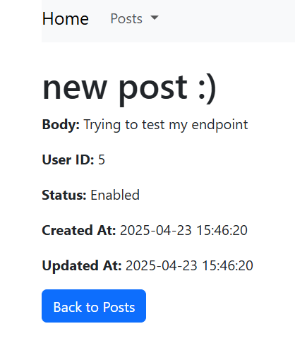

### Create Post Validation
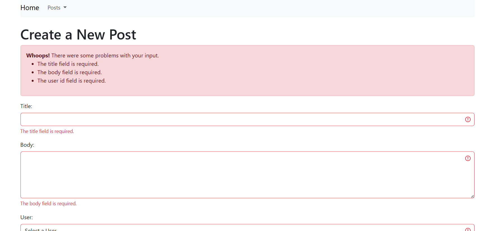

### User Id List
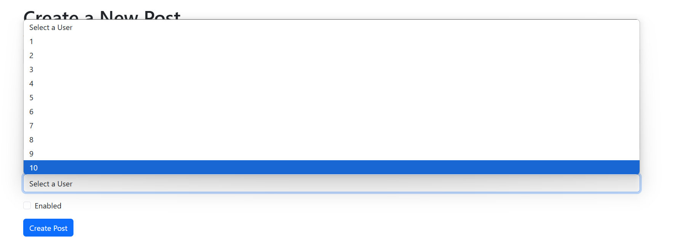

### Create Post Result
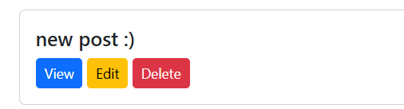

### Update Post
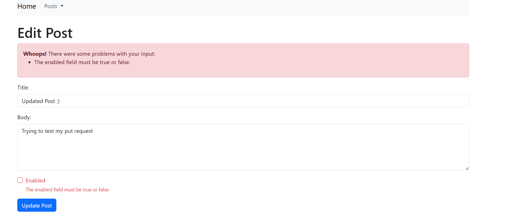

### Update Post Result
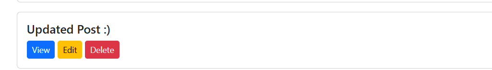

